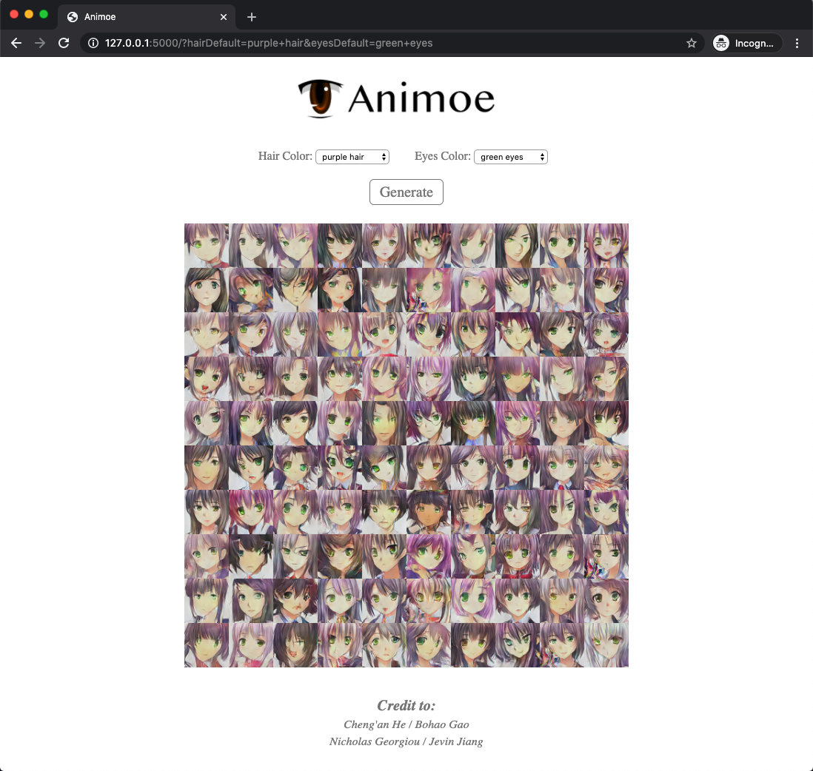

<div align="center">
    
</div>

### Dataset

The original dataset can be downloaded from the [Danbooru 2018 Anime Character Recognition Dataset](https://github.com/grapeot/Danbooru2018AnimeCharacterRecognitionDataset). We then remove those black-white or grayscale images with `preprocess.py` since their inclusion increases the instability in GAN's training.

### Notes

1. The anime eye icon in the logo is adapted from [Wikipedia](https://en.wikipedia.org/wiki/File:Anime_eye.svg).


### Web Application 

#### Demo
[LINK](https://drive.google.com/file/d/1NXwHeaoiNIMDaAmbylT8oezc6Px14P1F/view?usp=sharing)

#### Environment
> Python virtual environment is recommended!

```bash
pip install Flask
```

#### Run

```bash
python3 webapp.py {your .pth model file path}
```

Example:
```bash
python3 webapp.py output/netG_epoch_200.pth
```

#### Web App Preview
> open http://127.0.0.1:5000/


